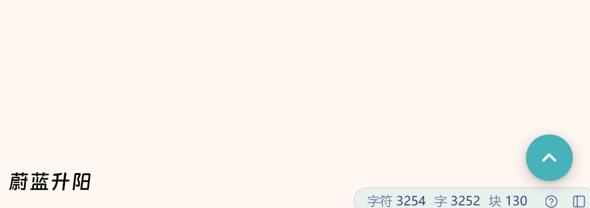

# 回到顶部

一个轻量的思源笔记插件：在编辑区右下角添加一个悬浮的「**回到顶部**」按钮，行为与大多数网页里常见的"返回顶部"按钮完全一致——默认隐藏，向下滚动超过阈值后淡入出现，点击则平滑滚回当前文档顶部。

[](preview.png)

## 功能特性

- ✨ **网页风格的悬浮按钮**：固定在右下角，圆角 + 阴影，自带悬浮 / 按压动画。
- 👁️ **智能显示 / 隐藏**：在文档顶部时不显示，当前编辑器向下滚动超过 **120 px** 后自动淡入。
- 🧭 **识别活跃编辑器**：自动匹配当前聚焦/可见文档的真实滚动容器（兼容多页签、多面板、`.protyle-content`、`.protyle-scroll`、`.layout-tab-container` 等）。
- 🚀 **平滑滚动**：优先使用原生 `scrollTo({behavior:"smooth"})`，不支持的环境自动降级为 `requestAnimationFrame + easeOutCubic` 动画。
- ⚡ **节流更新**：所有滚动 / 尺寸变化事件都经过 `requestAnimationFrame` 节流，不会影响输入和滚动性能。
- 🌗 **主题自适应 + 响应式**：通过思源 CSS 变量适配亮 / 暗色主题，窄屏（手机/平板）自动缩小尺寸并贴得更靠边缘。
- 🛡️ **干净的生命周期**：严格遵循思源插件规范（`extends Plugin`、`constructor super(...args)`、`onload / onLayoutReady / onunload`），禁用插件时会完整移除按钮 DOM、监听器和定时器。

## 安装

### 方式一：从社区集市安装（推荐）

当本插件发布到社区集市后，在 **思源 → 设置 → 插件 → 集市** 里搜索 **「回到顶部」或 Back to Top**，然后点击「安装」即可。

### 方式二：本地安装 / 手动安装

1. 在 [GitHub Releases](https://github.com/hong602/com.sunazure.backtotop/releases) 页面下载发布附件 `package.zip`。
2. 打开 **思源 → 设置 → 插件 → 已下载 → 安装本地插件**，选择这个 `package.zip`。
3. 打开「**回到顶部**」对应的开关。
4. 打开任意一篇较长的笔记，向下滚动一小段，按钮即会出现在右下角。

## 使用方式

1. 在思源中打开一篇较长的文档。
2. 向下滚动大约 **120 像素**（差不多一段文字或更少）。
3. 右下角会出现一个蓝色圆形按钮，中间有 **向上箭头 ⬆**。
4. 点击按钮：当前文档会**平滑滚动到最顶部**，回到顶部后按钮会自动淡出隐藏。

> 💡 小提示：即使打开了多个页签或分栏，按钮也会始终作用于当前"有焦点 / 可见"的那个文档对应的滚动容器，不会滚错页面。

## 配置

本插件为开箱即用，**不提供设置面板**。默认参数如下，如需自定义可直接修改对应文件：

| 项目 | 默认值 | 说明 | 修改位置 |
|---|---|---|---|
| 显示阈值 | 120 像素 | 当前编辑器向下滚动多少像素后显示按钮 | `index.js` 顶部 `THRESHOLD` |
| 位置 | 右 30 / 下 40 | 屏幕 ≤ 768px 时自动变为右 18 / 下 26 | `index.css` |
| 按钮尺寸 | 44×44 | 屏幕 ≤ 768px 时自动变为 40×40 | `index.css` |
| 平滑滚动时长 | ~320 毫秒 | 有原生 smooth 则用原生 | `index.js` 中 `duration` |
| 颜色 | 主题主色 `var(--b3-theme-primary)` | 随主题和亮/暗模式变化 | `index.css` |

## 兼容性

| 维度 | 支持 |
|---|---|
| 最低思源版本 | `2.8.0+` |
| 前端环境 | desktop、desktop-window、browser-desktop、browser-mobile、mobile |
| 后端环境 | Windows、macOS、Linux、Docker、Android、iOS、鸿蒙 |
| 发布服务 | 默认不禁用（`disabledInPublish: false`，但按钮为编辑器侧 UI） |

## 目录结构

```
com.sunazure.backtotop/
├── plugin.json        # 插件元数据
├── index.js           # 入口代码（纯 JS，无需构建）
├── index.css          # 按钮样式（亮/暗主题 + 响应式）
├── icon.png           # 160×160 插件图标
├── preview.png        # 1024×768 集市预览图
├── README.md          # 英文说明
├── README_zh-CN.md    # 中文说明（本文件）
└── CHANGELOG.md       # 版本更新记录
```

## 常见问题

**Q: 我滚动了很多也看不到按钮？**
- 先到 **设置 → 插件** 里确认「回到顶部」已启用。
- 改完插件文件后需要**完整重启思源**（后端只在加载插件时读取一次 `index.js/index.css`）。
- 打开开发者工具 `Ctrl + Shift + I`，在 Console 里过滤 `[backtotop]`，如果一行都没有，说明插件没有被成功加载；把报错信息发到 Issue 里即可。

**Q: 按钮出来了，但点击没反应？**
- 点击的是当前文档正文里任意位置，让焦点进入该编辑器后再点按钮试试。
- 仍无效的话打开 Console 再点一次按钮，会打印一行 `[backtotop] 点击回到顶部，scroller=... scrollTop=...`，把 `scroller` 的内容贴到 Issue 里即可排查。

**Q: 这个插件会读取我的笔记内容 / 联网吗？**
- 不会。插件 100% 运行在前端，不会写入 data 目录，也不会发起任何网络请求。

## 反馈 & 参与贡献

- Bug 反馈、功能建议：[GitHub Issues](https://github.com/hong602/com.sunazure.backtotop/issues)
- 欢迎提交 Pull Request，请说明改动目的和效果。

## 作者

- **蔚蓝升阳**
- 项目仓库：<https://github.com/hong602/com.sunazure.backtotop>

## 许可证

MIT
